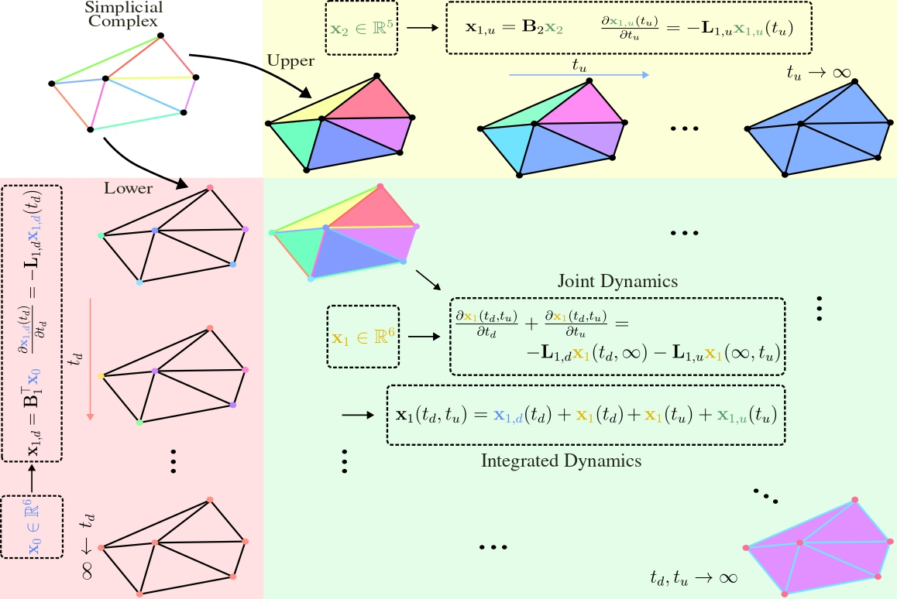

# Continuous Simplicial Neural Networks (COSIMO)

This is the repository of the paper ["*Continuous Simplicial Neural Networks*"](https://arxiv.org/abs/2503.12919) published in the thirty-ninth annual Conference on Neural Information Processing Systems (NeurIPS 2025).

## Abstract

Simplicial complexes provide a powerful framework for modeling higher-order interactions in structured data, making them particularly suitable for applications such as trajectory prediction and mesh processing. However, existing simplicial neural networks (SNNs), whether convolutional or attention-based, rely primarily on discrete filtering techniques, which can be restrictive. In contrast, partial differential equations (PDEs) on simplicial complexes offer a principled approach to capture continuous dynamics in such structures. In this work, we introduce **co**ntinuous **sim**plicial neural netw**o**rk (COSIMO), a novel SNN architecture derived from PDEs on simplicial complexes. We provide theoretical and experimental justifications of COSIMO's stability under simplicial perturbations. Furthermore, we investigate the over-smoothing phenomenon—a common issue in geometric deep learning.

---

<div align="center">
    <a href="./">
        
    </a>
</div>

---

## Getting Started


### Clone this Repository

```bash
git clone https://github.com/ArefEinizade2/COSIMO.git  
```

### Prerequisites

Our code requires Python >= 3.11.5

You can rely on installing the main packages, like [TopoNetX](https://github.com/pyt-team/TopoNetX) and [TopoModelX](https://github.com/pyt-team/TopoModelX/tree/main). For example, the current project has been implemented using the following packages:

```bash
torchmetrics==1.2.0
torch==2.1.0+cu118
tsl==0.9.4
pytorch-lightning==2.1.2
torch_geometric==2.4.0
networkx==3.3
TopoNetX==0.1.1
TopoModelX==0.0.1
```

### Run the Code
With the requirements installed, the scripts are ready to be run and used.

#### 1. Over-smoothing analysis:
- For analyzing the over-smoothing aspect of the COSIMO, in the Oversmoothing_Analysis folder, run **Oversmoothing_Analysis.ipynb**.

#### 2. Stability analysis:
- For analyzing the stability aspect of the COSIMO, in the Stability_Analysis folder, run **Stability_Analysis.ipynb**.

#### 3. Regression on meshes of partially deformable shapes:
- For generating the results on the Shrec16 small or full dataset, in the Mesh_Shrec16 folder, run **Results_Shrec16_Small.ipynb** or **Results_Shrec16_Full.ipynb**, respectively, or:
```bash 
python3 Results_Shrec16_Small.py
python3 Results_Shrec16_Full.py
```

#### 4. Node classification tasks:
- For generating the results on the Node Classification tasks, first, the [contact-high-school](https://www.cs.cornell.edu/~arb/data/contact-high-school-labeled/) and [senate-bills](https://www.cs.cornell.edu/~arb/data/senate-bills/) datasets should be downloaded from (https://www.cs.cornell.edu/~arb/data/)[https://www.cs.cornell.edu/~arb/data/]; their .txt files should be placed in the folder Node_Classification/data/node classification. Then, in the Node_Classification folder, run **Results_HighSchool.ipynb** or **Results_Senate.ipynb** to generate the results on the High-School or Senate-Bills datasets, respectively, or:
```bash 
python3 Results_HighSchool.py
python3 Results_Senate.py
```

#### 5. Graph classification task:
- For generating the results on the Graph Classification task, first, the Proteins dataset should be downloaded from [TUDatasets](https://chrsmrrs.github.io/datasets/docs/datasets/). Next, the dataset preparation should be done following the implementation codes of the paper [TopoSRL: Topology Preserving Self-Supervised Simplicial Representation Learning](https://github.com/HirenMadhu/TopoSRL/tree/main). Afterward, files should be placed in the folder Graph_Classification/data/graph classification. Then, in the Graph_Classification folder, run **Results_Proteins.ipynb**, or:
```bash 
python3 Results_Proteins.py
```

- ***Remark 1**: Note that the proposed COSIMO module has been used in different architectures across synthetic and real-world datasets, depending on their downstream learning tasks.*
- ***Remark 2**: The implementation codes will be reviewed on a regular basis to enhance their readability as much as possible.*


## Citation
If you use our code, please consider citing our work:

```bash
@article{einizade2025continuous,
  title={Continuous Simplicial Neural Networks},
  author={Einizade, Aref and Thanou, Dorina and Malliaros, Fragkiskos D and Giraldo, Jhony H},
  journal={arXiv preprint arXiv:2503.12919},
  year={2025}
}
```

## Acknowledgements
This research was supported by  DATAIA Convergence Institute as part of the «Programme d’Investissement d’Avenir», (ANR-17-CONV-0003) operated by the center Hi! PARIS. This work was also partially supported by the EuroTech Universities Alliance, and the ANR French National Research Agency under the JCJC projects DeSNAP (ANR-24-CE23-1895-01) and GraphIA (ANR-20-CE23-0009-01). 

- Some segments of the codes were adapted from the implementation codes of the papers [TIDE: Time derivative diffusion for deep learning on graphs](https://github.com/maysambehmanesh/TIDE), [TopoSRL: Topology Preserving Self-Supervised Simplicial Representation Learning](https://github.com/HirenMadhu/TopoSRL/tree/main), and [Hodge-Aware Convolutional Learning on Simplicial Complexes](https://github.com/cookbook-ms/Learning_on_SCs).

## Contact
For any query, please contact me at: **aref dot einizade at telecom-paris dot fr**
